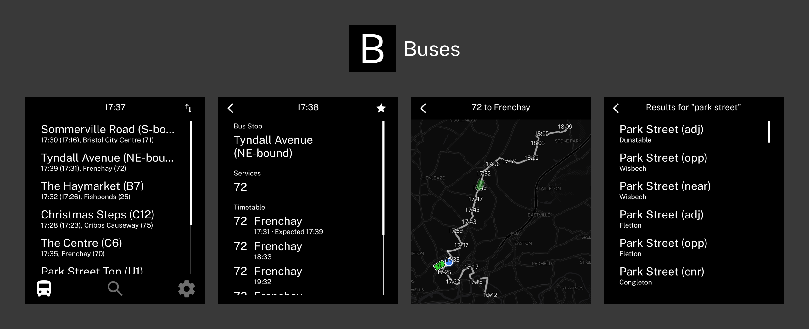

<p>A bus-only Expo app built on the LightOS-style template.</p>

## Quick Start

1. Run `bun install`
2. Add any runtime keys you want to use:
   - `EXPO_PUBLIC_MAPTILER_KEY` for vehicle maps
   - `EXPO_PUBLIC_FIRST_BUS_API_KEY` for First Bus seat enrichment
3. Run `bun dev`

## Commands

```bash
bun dev                      # Build and run
bun run sync-version         # Sync version across files
bun run generate-icon        # Generate icon from app name
bun run generate-readme-image  # Generate README example image
bun run build-stops-db       # Rebuild bundled local stop search database
```

## Search Data

The app bundles `assets/data/stops.db` so stop search works quickly offline-first. Rebuild it from NaPTAN with `bun run build-stops-db` when you want to refresh the dataset.

## Maps And Live Data

Stop details, browsing, and vehicle tracking use live bustimes data. Vehicle maps require `EXPO_PUBLIC_MAPTILER_KEY`; if it is missing, the tracking screen shows a clear setup message instead of a blank map.

## Detailed Docs

See [AGENTS.md](./AGENTS.md) for complete component reference, patterns, and examples.
